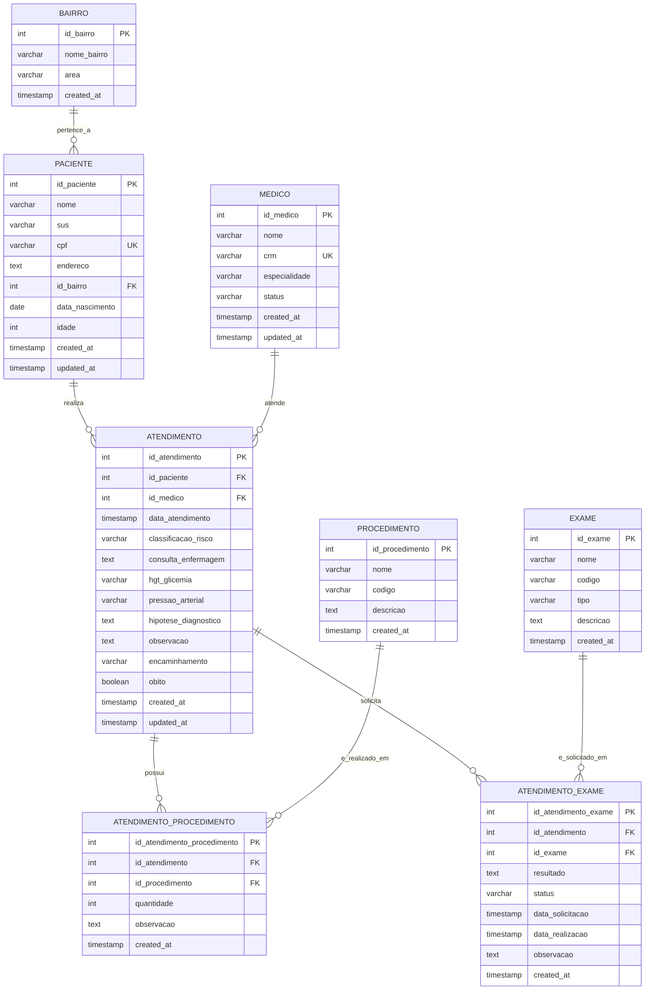

# Diagrama de Entidade-Relacionamento (DER)

## Descrição dos Relacionamentos

### 1. BAIRRO → PACIENTE (1:N)
- **Cardinalidade**: Um bairro pode ter muitos pacientes
- **Descrição**: Cada paciente pertence a um bairro específico
- **Chave Estrangeira**: `id_bairro` em PACIENTE

### 2. PACIENTE → ATENDIMENTO (1:N)
- **Cardinalidade**: Um paciente pode ter muitos atendimentos
- **Descrição**: Histórico de atendimentos do paciente
- **Chave Estrangeira**: `id_paciente` em ATENDIMENTO

### 3. MÉDICO → ATENDIMENTO (1:N)
- **Cardinalidade**: Um médico pode realizar muitos atendimentos
- **Descrição**: Atendimentos realizados por cada médico
- **Chave Estrangeira**: `id_medico` em ATENDIMENTO

### 4. ATENDIMENTO ↔ PROCEDIMENTO (N:N)
- **Cardinalidade**: Muitos para muitos
- **Descrição**: Um atendimento pode incluir vários procedimentos e um procedimento pode ser realizado em vários atendimentos
- **Tabela Intermediária**: ATENDIMENTO_PROCEDIMENTO

### 5. ATENDIMENTO ↔ EXAME (N:N)
- **Cardinalidade**: Muitos para muitos
- **Descrição**: Um atendimento pode solicitar vários exames e um tipo de exame pode ser solicitado em vários atendimentos
- **Tabela Intermediária**: ATENDIMENTO_EXAME

## Regras de Negócio Implementadas

### Integridade Referencial
- Todos os relacionamentos utilizam chaves estrangeiras com constraints
- Exclusão em cascata configurada quando apropriado

### Validações
- CPF único por paciente
- CRM único por médico
- Classificação de risco limitada a valores predefinidos
- Status de exames controlado por enum

### Auditoria
- Campos `created_at` e `updated_at` em todas as tabelas principais
- Triggers automáticos para atualização de timestamps

### Funcionalidades Automáticas
- Cálculo automático da idade baseado na data de nascimento
- Atualização automática de timestamps em modificações
