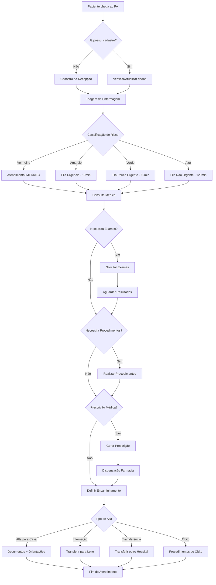
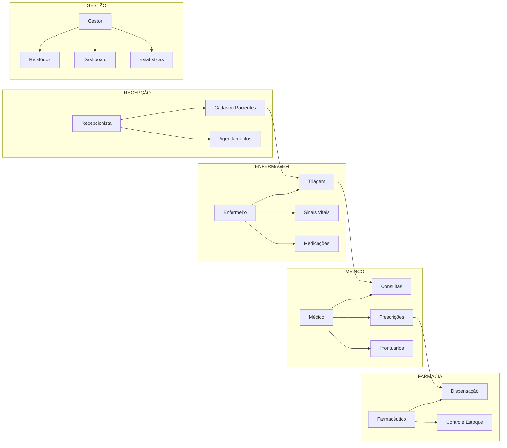
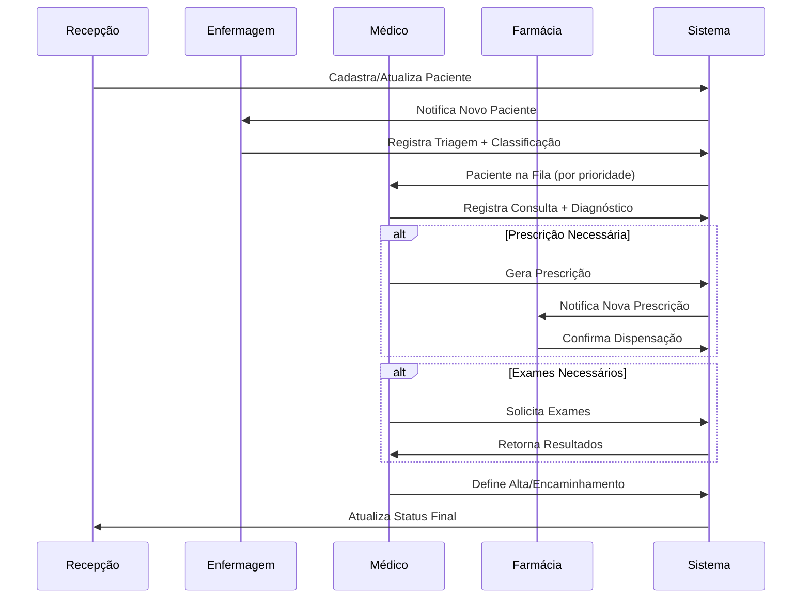

# Diagrama de Fluxo de Processos - MedSystem

## Fluxo Principal de Atendimento

## Fluxo de Usuários do Sistema

## Integração com Interface MedSystem

### Mapeamento dos Módulos da Sidebar

| Módulo da Interface | Funcionalidade | Usuários Principais |
|-------------------|----------------|---------------------|
| **Dashboard** | Visão geral em tempo real | Todos os usuários |
| **Pacientes** | Cadastro e busca de pacientes | Recepcionista, Enfermeiro |
| **Agendamentos** | Controle de consultas agendadas | Recepcionista |
| **Consultas** | Registro de atendimentos médicos | Médico, Enfermeiro |
| **Prontuários** | Histórico completo do paciente | Médico |
| **Medicamentos** | Prescrição e dispensação | Médico, Farmacêutico |
| **Estatísticas** | KPIs e métricas operacionais | Gestor, Coordenação |
| **Relatórios** | Relatórios gerenciais | Gestor, Administração |
| **Configurações** | Parametrização do sistema | Administrador |
| **Ajuda** | Documentação e suporte | Todos os usuários |

### Estados dos Componentes da Interface

#### Cards de Estatísticas (Dashboard)
- **Pacientes Ativos**: Contagem em tempo real
- **Atendimentos Hoje**: Contador incremental
- **Idade Média**: Cálculo automático
- **Casos Prioritários**: Filtro por classificação vermelha/amarela

#### Tabela de Pacientes
- **Status em Tempo Real**: 
  - `Em Observação` (amarelo)
  - `Estável` (verde)
  - `Crítico` (vermelho)
  - `Alta` (azul)

#### Indicadores de Prioridade
- **Ponto Vermelho**: Emergência
- **Ponto Amarelo**: Urgência  
- **Ponto Verde**: Não urgente

#### Alertas do Sistema
- **Alertas Médicos**: Pacientes que requerem atenção
- **Alertas de Sistema**: Notificações operacionais
- **Alertas de Medicamento**: Interações e contraindicações

## Fluxo de Dados Entre Módulos

## Cronologia de um Atendimento Típico

| Tempo | Ação | Responsável | Módulo Sistema |
|-------|------|-------------|----------------|
| 08:00 | Chegada do paciente | - | - |
| 08:02 | Cadastro/Verificação | Recepcionista | Pacientes |
| 08:05 | Triagem (classificação verde) | Enfermeiro | Consultas > Triagem |
| 08:07 | Paciente na fila de espera | Sistema | Dashboard |
| 09:05 | Chamada para consulta | Médico | Consultas |
| 09:30 | Consulta finalizada | Médico | Prontuários |
| 09:32 | Prescrição gerada | Médico | Medicamentos |
| 09:35 | Medicamento dispensado | Farmácia | Medicamentos |
| 09:40 | Alta hospitalar | Médico | Consultas |
| 09:42 | Atendimento finalizado | Sistema | Dashboard |

**Tempo total:** 1h42min (dentro do esperado para classificação verde)

---

**Documento complementar ao Fluxo de Uso Principal**  
**Versão:** 2.1.0  
**Data:** 10 de Junho de 2025
