# Fluxo de Uso - Sistema de Pronto Atendimento Municipal

## Visão Geral

Este documento detalha o fluxo de uso do sistema MedSystem para o Pronto Atendimento Municipal, abrangendo desde a chegada do paciente até a finalização do atendimento e geração de relatórios.

## 📊 Diagrama Geral do Fluxo de Atendimento

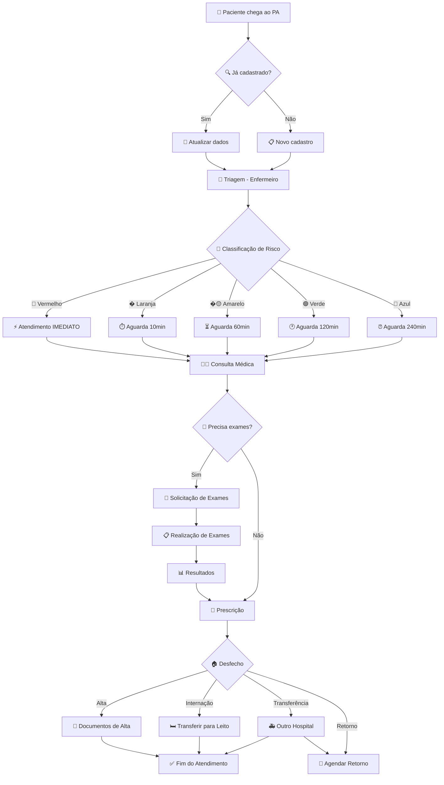

## Fluxos Principais

### 1. 🚪 Recepção e Triagem

#### 1.1 Chegada do Paciente
**Ator:** Recepcionista
**Módulo:** Pacientes

**Fluxo:**
1. Paciente chega ao pronto atendimento
2. Recepcionista acessa **Menu Lateral > Pacientes**
3. Verifica se paciente já está cadastrado:
   - **Busca por:** CPF, Nome ou Cartão SUS
   - **Se encontrado:** Atualiza dados se necessário
   - **Se não encontrado:** Realiza novo cadastro

**Dados Coletados:**
- Nome completo
- CPF
- Cartão SUS
- Data de nascimento (idade calculada automaticamente)
- Endereço completo
- Bairro/área de residência
- Telefone de contato

#### 1.2 Classificação de Risco
**Ator:** Enfermeiro(a)
**Módulo:** Consultas > Triagem

**Protocolo de Manchester:**
- 🔴 **Vermelho** - EMERGÊNCIA – atendimento imediato (0 minutos)
- 🟠 **Laranja** - MUITO URGENTE – atendimento praticamente imediato (10 minutos)
- 🟡 **Amarelo** - URGENTE – atendimento rápido, mas pode aguardar (60 minutos)
- 🟢 **Verde** - POUCO URGENTE – pode aguardar atendimento ou ser encaminhado para outros serviços de saúde (120 minutos)
- 🔵 **Azul** - NÃO URGENTE – pode aguardar atendimento ou ser encaminhado para outros serviços de saúde (240 minutos)

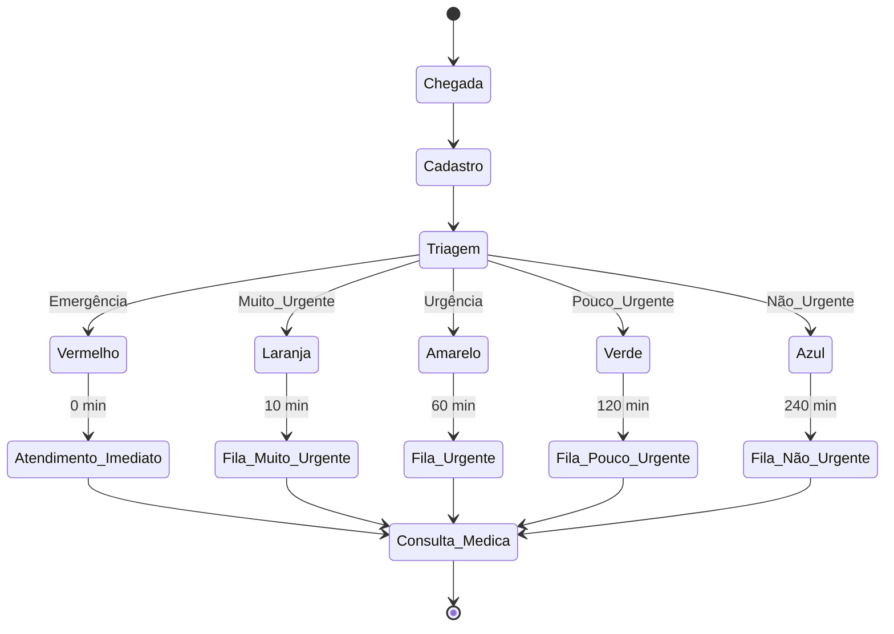

**Dados da Triagem:**
- Sinais vitais básicos
- Queixa principal
- Glicemia (HGT) se indicado
- Pressão arterial sistêmica
- Classificação de risco atribuída
- Observações da enfermagem

### 2. 👩‍⚕️ Atendimento Médico

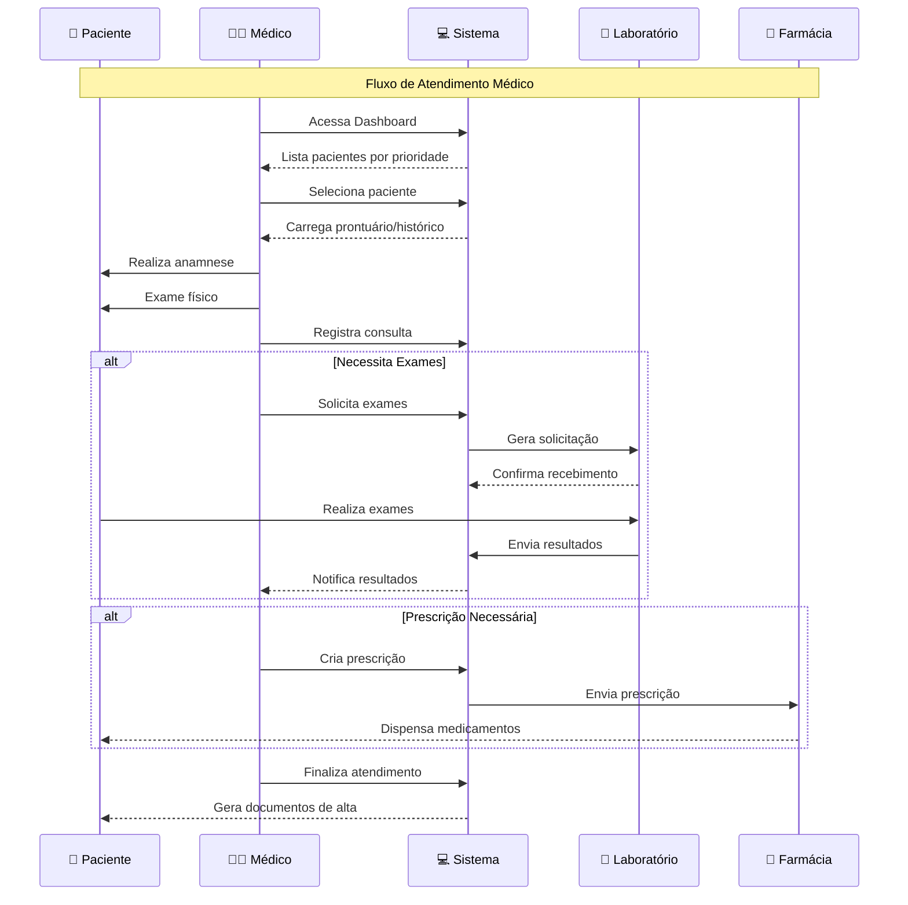

#### 2.1 Consulta Médica
**Ator:** Médico
**Módulo:** Consultas > Nova Consulta

**Fluxo de Atendimento:**
1. Médico acessa **Dashboard** para visualizar fila de pacientes
2. Seleciona paciente por ordem de prioridade (classificação de risco)
3. Acessa **Prontuários** para revisar histórico
4. Realiza consulta e registra:
   - Anamnese
   - Exame físico
   - Hipótese diagnóstica
   - Conduta médica

#### 2.2 Solicitação de Exames
**Módulo:** Consultas > Exames

**Tipos de Exames Disponíveis:**
- **Laboratoriais:** Hemograma, bioquímica, urina
- **Imagem:** Raio-X, ultrassom, tomografia
- **Eletrocardiograma**
- **Outros exames específicos**

**Fluxo:**
1. Médico seleciona exames necessários
2. Sistema gera solicitação com código único
3. Paciente é direcionado para coleta/realização
4. Resultados são integrados ao prontuário

#### 2.3 Procedimentos Médicos
**Módulo:** Consultas > Procedimentos

**Procedimentos Comuns:**
- Curativos
- Suturas
- Medicações endovenosas
- Inalações
- Imobilizações
- Drenagens

### 3. 💊 Prescrição e Medicamentos

#### 3.1 Prescrição Médica
**Módulo:** Medicamentos > Nova Prescrição

**Dados da Prescrição:**
- Medicamento (nome genérico/comercial)
- Dosagem e via de administração
- Frequência e duração
- Orientações especiais
- Interações medicamentosas (alertas automáticos)

#### 3.2 Dispensação
**Ator:** Farmacêutico/Técnico
**Módulo:** Medicamentos > Dispensação

**Controles:**
- Verificação de prescrição válida
- Controle de estoque
- Registro de dispensação
- Orientação ao paciente

### 4. 📋 Finalização do Atendimento

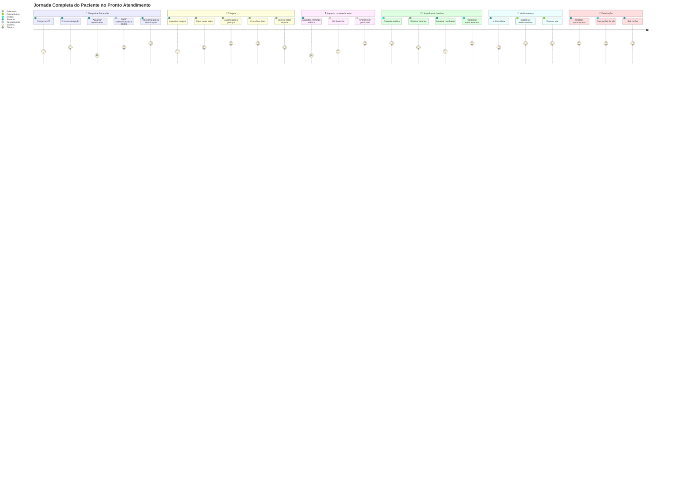

#### 4.1 Desfecho do Atendimento
**Módulo:** Consultas > Finalizar Atendimento

**Opções de Encaminhamento:**
- **Alta hospitalar** - Paciente liberado para casa
- **Internação** - Transferência para leito
- **Transferência** - Outro hospital/especialidade
- **Retorno** - Agendamento de retorno
- **Óbito** - Registro de óbito (se aplicável)

#### 4.2 Documentação
**Documentos Gerados:**
- Receita médica
- Atestado médico
- Guia de encaminhamento
- Relatório de atendimento
- Declaração de comparecimento

### 5. 📊 Monitoramento e Relatórios

#### 5.1 Dashboard em Tempo Real

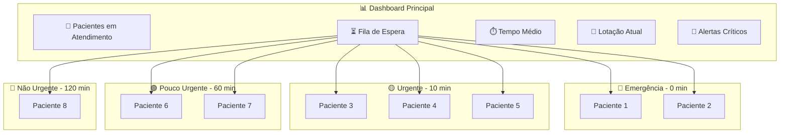

**Módulo:** Dashboard Principal

**Indicadores Principais:**
- Pacientes em atendimento
- Fila de espera por classificação
- Tempo médio de atendimento
- Lotação atual
- Alertas de pacientes críticos

#### 5.2 Relatórios Gerenciais
**Módulo:** Relatórios

**Relatórios Disponíveis:**
- **Diário:** Atendimentos realizados no dia
- **Semanal:** Estatísticas da semana
- **Mensal:** Relatório consolidado mensal
- **Por Médico:** Performance individual
- **Por Classificação:** Distribuição de riscos
- **Epidemiológico:** Principais diagnósticos

## Fluxos Especiais

### 6. 🚨 Atendimento de Emergência

#### 6.1 Emergência Médica
**Classificação:** Vermelho
**Tempo:** Imediato

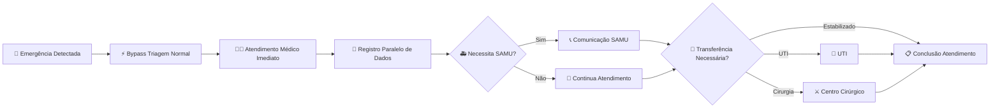

**Fluxo Acelerado:**
1. Paciente bypassa triagem normal
2. Atendimento médico imediato
3. Registro paralelo dos dados
4. Comunicação com SAMU se necessário
5. Possível transferência para UTI/cirurgia

#### 6.2 Óbito
**Módulo:** Consultas > Registro de Óbito

**Procedimentos:**
1. Registro da hora do óbito
2. Preenchimento de declaração de óbito
3. Comunicação com família
4. Liberação do corpo
5. Notificação aos órgãos competentes

### 7. 👥 Gestão de Usuários

#### 7.1 Perfis de Acesso

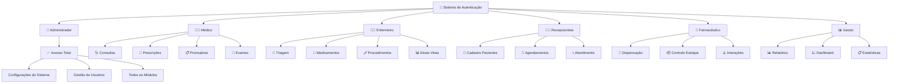

- **Administrador:** Acesso total ao sistema
- **Médico:** Consultas, prescrições, prontuários
- **Enfermeiro:** Triagem, medicamentos, procedimentos
- **Recepcionista:** Cadastro de pacientes, agendamentos
- **Farmacêutico:** Medicamentos, dispensação
- **Gestor:** Relatórios, dashboard, estatísticas

#### 7.2 Controle de Acesso

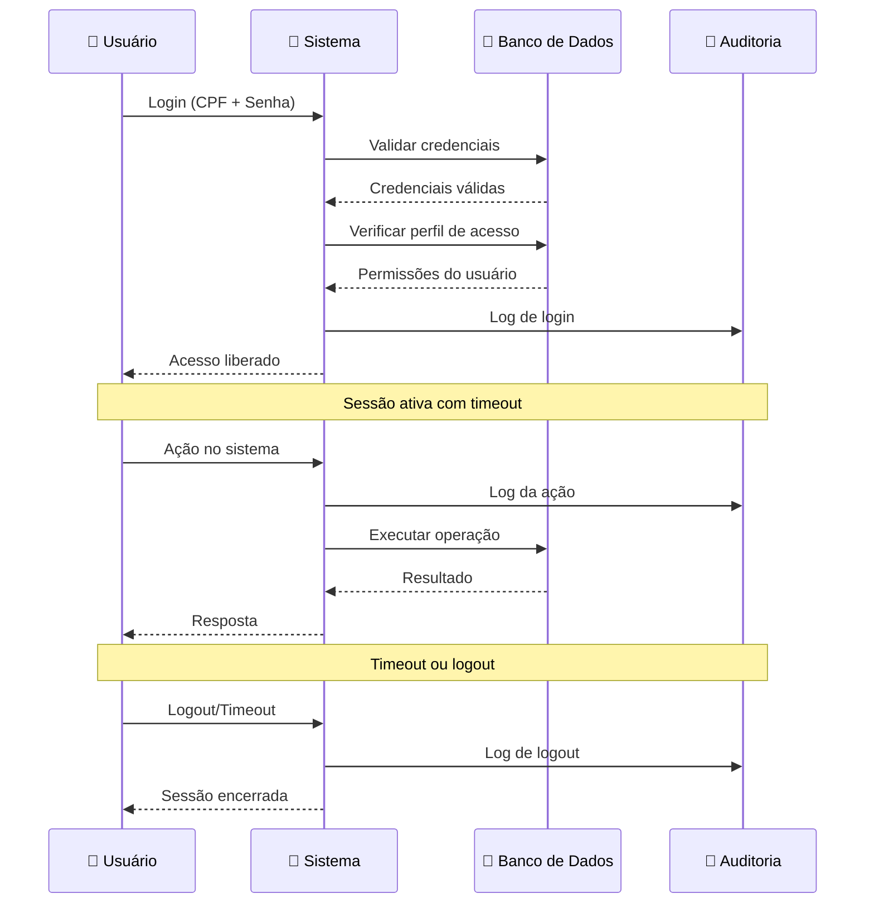

- Login com CPF e senha
- Sessão com timeout automático
- Log de auditoria de todas as ações
- Controle por módulos e funcionalidades

### 8. 📱 Funcionalidades Móveis

#### 8.1 Responsividade
- Interface adaptada para tablets
- Menu lateral colapsível
- Tabelas responsivas
- Formulários otimizados para toque

#### 8.2 Acessibilidade
- Contraste adequado para leitura
- Fontes legíveis
- Navegação por teclado
- Compatibilidade com leitores de tela

## Integrações Externas

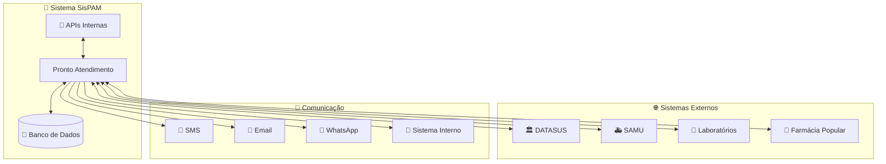

### 9.1 Sistemas de Saúde
- **DATASUS:** Sincronização de dados SUS
- **SAMU:** Comunicação de emergências
- **Laboratórios:** Recebimento de resultados
- **Farmácia Popular:** Verificação de medicamentos

### 9.2 Notificações
- **SMS:** Confirmação de consultas
- **Email:** Relatórios para gestores
- **WhatsApp:** Comunicação com pacientes
- **Sistema Interno:** Alertas e avisos

## Indicadores de Performance

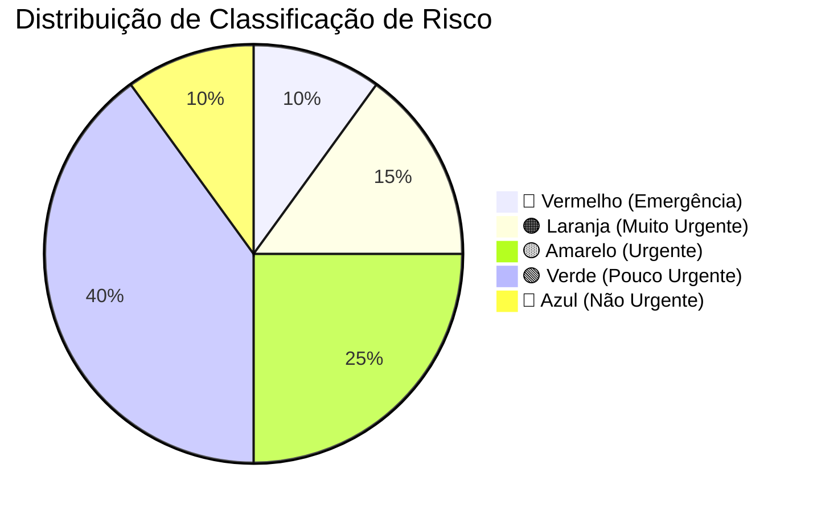

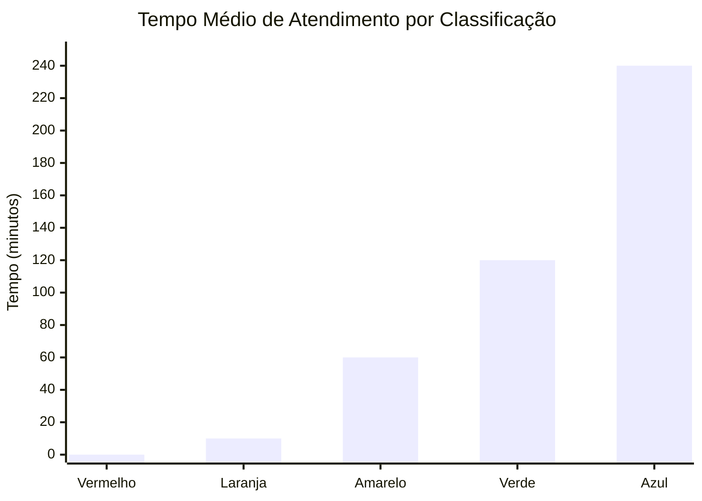

### 10.1 KPIs Operacionais
- **Tempo médio de espera por classificação**
- **Taxa de ocupação do pronto atendimento**
- **Número de atendimentos por médico/hora**
- **Taxa de retorno em 72h**
- **Satisfação do paciente**

### 10.2 KPIs Clínicos
- **Distribuição de classificação de risco**
- **Taxa de internação**
- **Taxa de transferência**
- **Principais diagnósticos**
- **Tempo porta-medicina**

## Considerações de Segurança

### 11.1 Proteção de Dados
- Conformidade com LGPD
- Criptografia de dados sensíveis
- Backup automático diário
- Controle de acesso por níveis

### 11.2 Auditoria
- Log completo de todas as ações
- Rastreabilidade de alterações
- Relatórios de auditoria
- Monitoramento de acessos suspeitos

## 🗃️ Arquitetura do Sistema

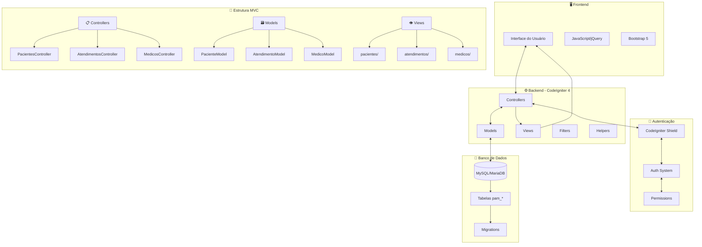

---

**Versão:** 2.1.0  
**Data de Criação:** 10 de Junho de 2025  
**Responsável:** Equipe de Desenvolvimento MedSystem  
**Aprovação:** Coordenação Médica e TI